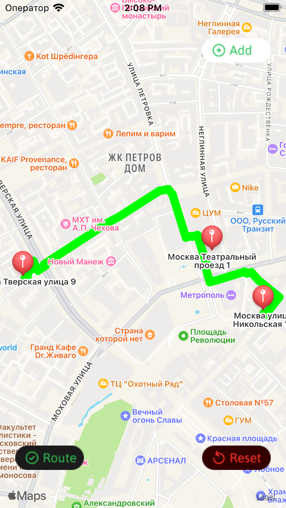

# Find Route

Проект "Find Route" создан для изучения использования MapKit с использованием UIKit в iOS-приложениях. Приложение предоставляет функциональность по построению кратчайшего маршрута через три заданные точки, решая задачу Коммивояжера.

## Описание проекта

Цель проекта - овладение основами работы с MapKit вместе с UIKit для создания приложения, которое может строить оптимальный маршрут через заданные точки. Пользователи могут добавлять точки на карту, а затем строить кратчайший маршрут, проходящий через все добавленные точки.

## Изученные концепции

- Использование MapKit для отображения карты и работы с географическими данными.
- Создание маркеров на карте с использованием MKAnnotation и MKPointAnnotation.
- Работа с функционалом построения маршрута через заданные точки.
- Работа с элементами интерфейса пользователя, такими как кнопки и алерты.

## Функциональность

Проект "Find Route" предоставляет следующую функциональность:

- **Добавление точек:**
  - Нажмите кнопку "Add", чтобы добавить новую точку на карту.
  - Новые точки отображаются в виде маркеров.

  
  
  
  
  
  

- **Построение маршрута:**
  - После добавления трех точек появляются кнопки "Route" и "Reset".
  - Нажмите "Route", чтобы построить кратчайший маршрут через все добавленные точки.
  - Кратчайший маршрут отображается на карте.

  
  

- **Очистка карты:**
  - Нажмите "Reset", чтобы удалить маршрут и все добавленные точки на карте.

  
  

## Запуск проекта

Для запуска проекта выполните следующие шаги:

1. Откройте проект в Xcode.
2. Убедитесь, что ViewController.swift выбран как основной контроллер интерфейса.
3. Запустите симулятор, выбрав устройство для запуска.
4. Интерфейс приложения "Find Route" с картой и функционалом построения маршрута будет отображен на экране.
